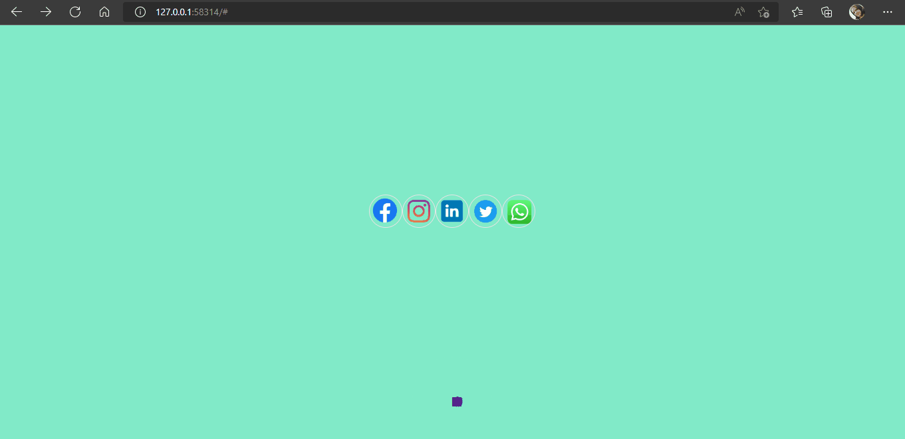

#### Teste com icones redes sociais.

#### Desafio  adicionar movimento com JavaScript

#### Clicando dentro do circulo vai abrir as opções das redes sociais.

[]

#### Tecnologias Utilizadas

 
    
   
  
  
  

 

[ ]

